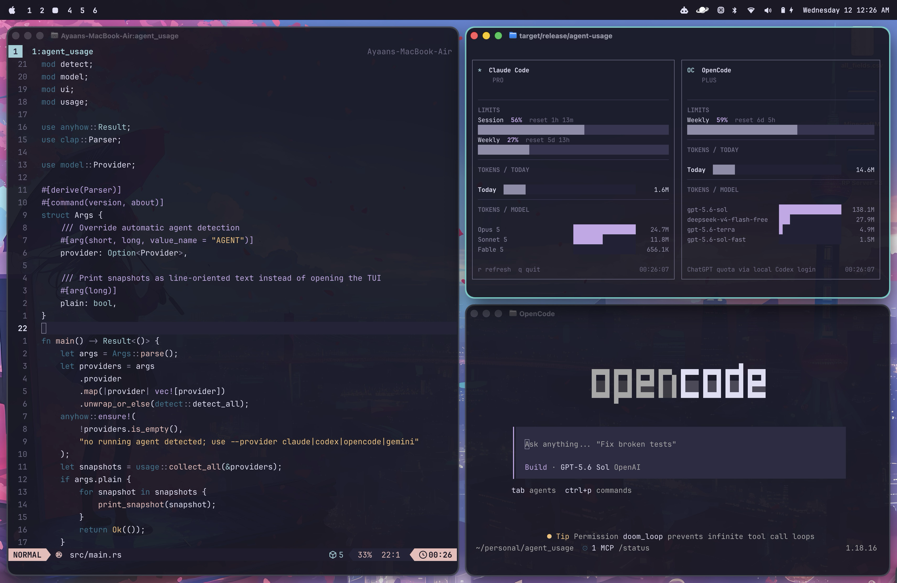

# agent-usage

[](https://github.com/mayaanhafeez/agent-usage/actions/workflows/ci.yml)
[](LICENSE)
[](https://www.rust-lang.org/)

A focused terminal dashboard for tracking coding-agent usage. `agent-usage`
detects supported agents that are currently running, combines their local token
history with available account limits, and presents everything in one TUI.



## Features

- Detects running Claude Code, Codex, OpenCode, and Gemini CLI processes
- Shows multiple active agents side by side
- Breaks down the last seven days by day and model
- Displays session or weekly account limits when a provider exposes them
- Reads existing local client data without storing credentials or usage
- Includes a plain-text mode for scripts and terminal snapshots
- Supports macOS and Linux

## Providers

| Agent | Local usage source | Account limit source |
| --- | --- | --- |
| Claude Code | `~/.claude/projects/**/*.jsonl` | Anthropic Claude OAuth usage endpoint |
| Codex | `~/.codex/sessions/**/*.jsonl` | ChatGPT Codex usage endpoint |
| OpenCode | OpenCode's local SQLite database | ChatGPT quota when GPT models and a Codex login are detected |
| Gemini CLI | `~/.gemini/tmp/**/chats/*.json` | Not exposed by Gemini CLI |

See [Data sources and privacy](docs/data-sources.md) for the exact files,
network requests, and token-counting behavior.

Grok is not currently supported because it does not have a canonical coding
agent CLI or stable local usage store. An adapter can be added once one exists.

## Install

### From source

Rust 1.85 or newer is required.

```sh
git clone https://github.com/mayaanhafeez/agent-usage.git
cd agent-usage
cargo install --path .
```

### Run without installing

```sh
cargo run --release
```

## Usage

Start one or more supported coding agents, then run:

```sh
agent-usage
```

Automatic mode shows every detected agent. Use `--provider` for a focused view
or `--plain` for line-oriented output:

```sh
agent-usage --provider claude
agent-usage --provider codex --plain
agent-usage --provider opencode
agent-usage --provider gemini
```

Set `AGENT_USAGE_PROVIDER` to override process detection in an alias or script:

```sh
AGENT_USAGE_PROVIDER=opencode agent-usage
```

Run `agent-usage --help` for all options.

## Controls

| Key | Action |
| --- | --- |
| `r` | Refresh local history and remote limits |
| `q` or `Esc` | Quit |

## Privacy

`agent-usage` is read-only. It uses credentials already managed by official
clients, sends tokens only to that provider's official usage endpoint, and does
not write credentials, telemetry, or usage data. Local history remains on your
machine.

## Platform notes

macOS and Linux are supported. Claude credentials are read from Keychain on
macOS and from `~/.claude/.credentials.json` on either platform. SQLite is
bundled, so OpenCode support does not require a system SQLite installation.

## Contributing

Bug reports and pull requests are welcome. See [CONTRIBUTING.md](CONTRIBUTING.md)
for the development workflow.

## License

Licensed under the [MIT License](LICENSE).
